# Informe General del TP System Programming

## Parte 1: Pasar de Modo Real a Modo Protegido.

Comenzamos el TP viendo como pasar un procesador de modo real a modo protegido, antes que nada, definamos que son estos modos. 
Estos son los diferentes modos (valga la redundancia) de operar que tienen los procesadores de Intel. 

-	El Modo Real nos provee el entorno de programación de un Intel 8086 (16 bits); con algunas excepciones; como por ejemplo la posibilidad de cambiar a Modo Protegido. 
-	El Modo Protegido es el modo nativo de operar, cuenta con retrocompatibilidad con programas anteriores, flexibilidad, alto rendimiento y un set de funciones que van más allá de lo que se puede lograr en modo real. 
Si bien se podría desarrollar un SO en modo real, estaríamos limitados al modo de 16 bits, no tendríamos acceso a todas las funcionalidades del procesador, entonces lo estaríamos limitando a imitar al 8086, perdiendo un montón de ventajas que nos proveería un procesador mas actualizado. 


La primera estructura que tuvimos que desarrollar en este trabajo es la **GDT (Tabla Global de Descriptores de Segmento)**. Tenemos que desarrollarla ya que en modo real el esquema de manejo de memoria que se usa es la segmentación. 

Un **Descriptor de Segmentos** es una estructura de datos almacenada en una **GDT** o **LDT** que provee al procesador del tamaño y ubicación de un segmento de memoria, así como también acceso de control (Tipo de segmento, Nivel de privilegio, etc.) e información de su estado actual. 

Un descriptor está formado por 8 bytes de información separada en distintas partes, cada una con una función específica:


- Segment Limit: Especifica el tamaño del segmento. Está dividido en 2 partes que representan un valor de 20 bits. Este será interpretado de diferente    forma dependiendo del valor de la flag de G.  

- Base Address: Nos indica la posición del byte 0 del segmento dentro de los 4GB te espacio de dirección linear. Está formado por 3 campos que en conjunto equivalen a un valor de 32 bits. 

- G Flag (Granularidad): Determina la escala del campo Segment Limit. Si la flag es 0 se interpreta en unidades de byte. Caso contrario, se lo interpreta en unidades de 4KiB.  

- P Flag (Segment-Present): Indica si un segmento está presente en memoria (Flag seteada) o no (Flag limpio).  

- DPL (Descriptor-Privilege-Level): Especifica el nivel de privilegio del segment. Este puede ir de 0 a 3, siendo 0 el nivel más privilegiado. Se utiliza para controlar el acceso al segmento 

- S Flag (Descriptor type): Especifica si un descriptor de segmento es para un segmento de sistema (Flag limpia) o para un Segmento de código o datos (Flag seteada).  

- Type: Define el tipo de segmento y su interpretación depende del bit S.  
    - S = 0 -> Descriptor de sistema (TSS, LDT, Interrupt Gate) :  

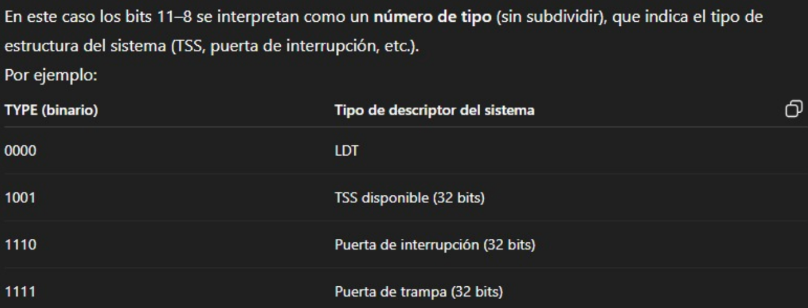

- S = 1 -> Descriptor de código o datos: 

    Si es de código (bit 11 = 1):
    -	Bit 10 (Conforming): Si es 1 codigo conforming (permite ejecución desde un nivel de privilegio menor al suyo). Si es 0 solo ejecutable en su mismo nivel.
    -	Bit 9 (Readable): Si es 1 se puede leer como datos, si es 0 solo ejecución.
    -	Bit 8 (Accesed): Lo pone la CPU en 1 cuando el segmento se usa. Se inicializa en 0.

    Si es de datos (bit 11 = 0):
    -	Bit 10 (Expand down): Si es 1 el segmento crece hacia abajo (usado para pilas). Si es 0 crece hacia arriba.
    -	Bit 9 (Writable): Si es 1 se puede escribir, si es 0 no.
    -	Bit 8 (Accesed): Lo pone la CPU en 1 cuando el segmento se usa. Se inicializa en 0.


Ahora que sabemos cómo funciona la **GDT**, sus descriptores y sus selectores de segmento debemos comenzar <!-- Inicializar? --> a sus indices y selectores de segmento. 

Según el manual de Intel, los selectores de segmento se comportan de la siguiente manera: 

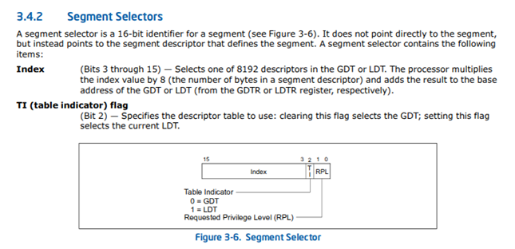

El **RPL** es un numero de 2 bits, que nos define el privilegio del segmento del 0 al 3 siendo 0 el más privilegiado (**Kernel**) y 3 el menos (**Usuario**). 

Para definir estas cosas debemos tener un archivo llamado defines.h y haremos lo siguiente: 

Primero que nada, en esta parte definimos que índices vamos a usar para nuestros descriptores de segmento guardados en la GDT. 

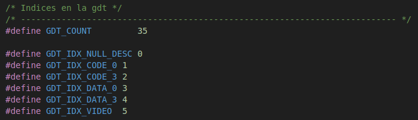

Luego en base a esos índex, shifteamos a izquierda el índice definido para poder completar el selector con su RPL correspondiente. El TI lo dejamos en 0 ya que es una GDT


Como ejemplos de cómo lucen las entradas de la GDT, adjuntamos imagen de las entradas mencionadas arriba:


Como no nos interesa realmente utilizar segmentacion; pues queremos pasar al Modo Protegido y utilizar Paginacion, utilizaremos Segmentacion Flat para poder anular lo mas posible sus efectos.

Para implementarlo creamos cuatro descriptores de segmento, dos para referenciar el segmento de código (Uno de nivel 0 y otro nivel 3) y dos más para referenciar el segmento de datos (Uno de nivel 0 y otro nivel 3).
 
Ambos se mapean al mismo espacio de direcciones completo. Osea: 

- Ambos tienen la misma dirección base (0).
- Y el mismo límite de segmento (4GB).

De esta manera, tanto el código como los datos “ven“ todo el rango de direcciones 0 a 4GB como una sola memoria plana.

Una vez definidos nuestros selectores de segmento y planificadas las entradas a la GDT, debemos crear un archivo **gdt.c** para implementar estas ultimas. Para ello llenaremos un arreglo de *gdt_entry_t* (tipo de dato definido en **gdt.h**), mostraremos un descriptor de ejemplo: 

<!---->

```c
[GDT_IDX_CODE_0] = {
    .limit_15_0 = 0x30FF,
    .base_15_0 = 0x0000,
    .base_23_16 = 0x00,
    .type = 0xB, // Accessed = 1
    .s = 0x01,
    .dpl = 0x00,
    .p = 0x01,
    .limit_19_16 = 0x03,
    .avl = 0x0,//Preguntar en clase
    .l = 0x0,
    .db = 0x1,
    .g = 0x01,
    .base_31_24 = 0x00,
},
```

Esto es un ejemplo de una de las *gdt_entry_t*, para mas detalle ingresar al archivo **gdt.c** en el tp de SP. 

A continuacion, activamos el bit 21 del bus de address del procesador. Gracias a esto podremos direccionar memoria mayor a 1 MiB (Este viene deshabilitado por default, pues el 8086 no podia direccionar mas de 1 MiB).
Para hacerlo invocamos a la funcion A20_enable dada por la catedra.

Antes de seguir explicando el codigo del proyecto, vamos a hablar de la instruccion LGDT (Load Global Descriptor Table Register), esta sirve para cargar en el registro GDTR (Global Descriptor Table Register) los valores de base y limite de la GDT (Global Descriptor Table). 
El operando que toma LGDT es un struct de 6 bytes (en modo 16 o 32 bits) o 10 bytes (en modo 64 bits), en ambos casos los 2 bytes mas bajos corresponden al limite y los restantes corresponden a la base, ambos datos son copiados dento del registro antes mencionado. 
Con estos valores copiados, el registro GDTR, se encarga de indicarnos donde se encuentra y de que tamaño es la GDT. 
La instruccion LGDT solo puede ejecutarse en codigo de sistema operativo, no en programas comunes. Generalmente la utilizamos durante la inicializacion del sistema operativo, antes de activar el modo protegido. 

Entonces en nuestro **kernel.asm** deberiamos tener esto. Son los pasos previos dentro del *Modo Real* antes de pasar al *Modo Protegido*: 

<!--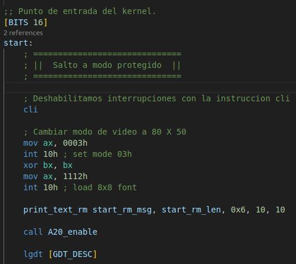-->

```x86asm
;; Punto de entrada del kernel.
[BITS 16]
start:
    ; ==============================
    ; ||  Salto a modo protegido  ||
    ; ==============================

    ;Deshabilitar interrupciones (Parte 1: Pasake a modo protegido)
    cli

    ; Cambiar modo de video a 80 X 50
    mov ax, 0003h
    int 10h ; set mode 03h
    xor bx, bx
    mov ax, 1112h
    int 10h ; load 8x8 font

    ;Imprimir mensaje de bienvenida - MODO REAL
    print_text_rm start_rm_msg, start_rm_len, 0x6, 10, 10

    ;Habilitar A20
    call A20_enable

    ;Cargar la GDT
    lgdt [GDT_DESC]
```

> La instruccion **cli** sirve para desactivar las interrupciones del sistema. 

Ya habiendo deshabilitado las interrupciones, completado la GDT y cargado el registro GDTR; solo nos queda habilitar el **Modo Protegido**. 
Para este debemos primero modificar el registro CR0, el cual contiene las **Flags de Control de Sistema** que controlan el modo de operación y estados del procesador.
Nos interesa setear el bit 0, pues este es el que marca si el **Modo Protegido** esta activado.


El codigo para activarlo quedaria de la siguiente forma:

<!--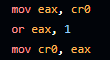-->
```x86asm
mov eax, cr0
or eax, 1
mov cr0, eax
```

Con el **Modo Protegido** ya habilitado, solo nos queda utilizar un **JMP Far** para saltar al mismo.
Para hacer este **JMP Far** necesitamos un *Selector de Segmento* y un *Offset*, utilizamos el selector de segmento que apunta al descriptor de segmento de kernel (Nivel 0) ubicado en nuestra GDT.

> Refresco de memoria sobre los **Selectores de segmento**:
>
> Este selector de segmento, que en total tiene 16 bits, estará formado de la siguiente manera:
>- Bits 15 - 3: Indice en la GDT/LDT (En este caso el indice sera 1, pues nuestro Descriptor de CS0 esta en la segunda posicion de la GDT).
>- Bit 2: Indica si el Descriptor esta en la GDT o LDT (0 = GDT, 1 = LDT).
>- Bit 1 - 0: Nivel de Privilegio Solicitado (RPL), en este caso sería 0 también.

El Selector quedaría de la forma: 
0000 0000 0000 1000 = 0x8 <- Este sera nuestro Selector de Segmento para el **JMP Far**

Como Offset utilizaremos simplemente la etiqueta que indica el inicio de nuestro codigo de kernel en **Modo Protegido**.

El JMP quedaría de la siguiente manera:

<!---->
```x86asm
jmp CS_RING_0_SEL:modo_protegido
```

Ya estando en **Modo Protegido**; el JMP Far que realizamos actualizo el registro CS cargandolo con el Selector de Segmento "CS_RING_0_SEL". El problema es que el resto de registos de segmento siguen teniendo valores desactualizados arrastrados desde el **Modo Real**, tenemos que actualizarlos manualmente cargandoles un *Selector de Segmento* de *Datos Nivel 0 (Kernel)*

<!--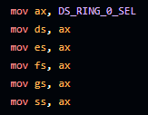-->
```x86asm
mov ax, DS_RING_0_SEL
mov ds, ax
mov es, ax
mov ds, ax
mov gs, ax
mov ss, ax
```

Procedemos a inicializar el tope y base del stack en la dirección 0x25000 (⬅️ Esto se explica mas adelante):

<!---->
```x86asm
mov ebp, 0x25000
mov esp, ebp
```

<!-- La parte de inicializar pantalla es completamente necesaria o solo es parte del TP? -->

# Parte 2: Interrupciones.

Ya habiendo cambiado a modo protegido, toca configurar las interrupciones. Comenzaremos por definir y cargar la **Interrumption Descriptor Table** o **IDT** para los amigos.

Comenzemos por describir como luce una entrada de la IDT:

Al igual que la GDT o la LDT, la IDT contiene Descriptores de Segmentos. Estos, sin embargo, no se comportan de la mimsa manera; pues sus bits toman ahora significados diferentes.


- Offset *(Bits 0 - 15, Primeros 31 bits)* y Offset *(Bits 16 - 31, Segundos 31 Bits)*: Corresponden a la parte baja y parte alta de la dirección del entry point de la rutina que manejará la interrupción.
- Segment Selector: es un selector de 16 bits que apunta a una entrada de la GDT o LDT, esta debe ser un segmento de código.
- P *(Present Flag)*: indica si un descriptor es válido o no.
- DPL *(Descriptor Privilege Level)*: son 2 bits que definen el nivel de privilegio minimo nescesario para invocar la interupción. 
- Type: indica si un segmento es de Interrupt, Trap o Task.

Tenemos definidas las IDT_ENTRY de Nivel 0 y 3 en `idt.c` de la siguiente forma:

- Interrupt Gate de Nivel 0

    <!--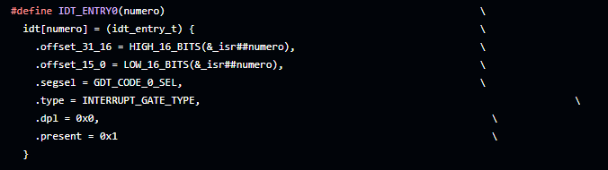-->
```c
#define IDT_ENTRY0(numero)                                                     \
  idt[numero] = (idt_entry_t) {                                                \
    .offset_31_16 = HIGH_16_BITS(&_isr##numero),                               \
    .offset_15_0 = LOW_16_BITS(&_isr##numero),                                 \
    .segsel = GDT_CODE_0_SEL,                                                  \
    .type = INTERRUPT_GATE_TYPE,                                                               \
    .dpl = 0x0,                                                                  \
    .present = 0x1                                                               \
  }
```
- Interrupt Gate de Nivel 3
      
    <!---->
```c
#define IDT_ENTRY3(numero)                                                     \
  idt[numero] = (idt_entry_t) {                                                \
    .offset_31_16 = HIGH_16_BITS(&_isr##numero),                               \
    .offset_15_0 = LOW_16_BITS(&_isr##numero),                                 \
    .segsel = GDT_CODE_0_SEL,                                                  \
    .type = INTERRUPT_GATE_TYPE,                                                               \
    .dpl = 0x03,                                                                  \
    .present = 0x1                                                               \
  }
```

Ya teniendo estos macros definidos, podemos agregar a la funcion `idt_init()` las siguientes interrupciones:

- Interrupcion de Reloj y Teclado (Nº 32 y 33, seran del tipo IDT_ENTRY0).

- System calls 88 y 98 (del tipo IDT_ENTRY3, estas podran ser llamadas por software de nivel de usuario).

La funcion completa queda de la siguiente manera:

<!--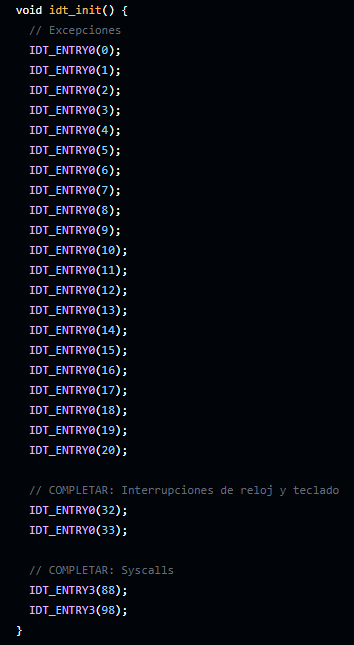-->
```c
void idt_init() {
  // Excepciones
  IDT_ENTRY0(0);
  IDT_ENTRY0(1);
  IDT_ENTRY0(2);
  IDT_ENTRY0(3);
  IDT_ENTRY0(4);
  IDT_ENTRY0(5);
  IDT_ENTRY0(6);
  IDT_ENTRY0(7);
  IDT_ENTRY0(8);
  IDT_ENTRY0(9);
  IDT_ENTRY0(10);
  IDT_ENTRY0(11);
  IDT_ENTRY0(12);
  IDT_ENTRY0(13);
  IDT_ENTRY0(14);
  IDT_ENTRY0(15);
  IDT_ENTRY0(16);
  IDT_ENTRY0(17);
  IDT_ENTRY0(18);
  IDT_ENTRY0(19);
  IDT_ENTRY0(20);

  //Interrupciones de reloj y teclado
  IDT_ENTRY0(32);
  IDT_ENTRY0(33);
  //Syscalls
  IDT_ENTRY3(88); 
  IDT_ENTRY3(98);
}
```

Solo nos falta inicializar y cargar la IDT, para esto llamamos a `idt_init` y luego utilizamos la instruccion `lidt` para cargarla en memoria:

<!--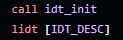-->
```x86asm
call idt_init
lidt [IDT_DESC]
```


Ahora tenemos que configurar el manejo de las interrupciones externas, de esto se encargará el **PIC** (Programable Interruption Controller).
Para ser mas especificos, el **PIC** se encarga de manejar las solicitudes de interrupciones correspondientes a diferentes perifericos y enviarlas a la CPU.
En el caso del TP, utilizamos el **Intel 8259 PIC**. Tendremos dos de estos, el **Master** (Conectado directamente a la CPU) y el **Slave** (Conectado al master):

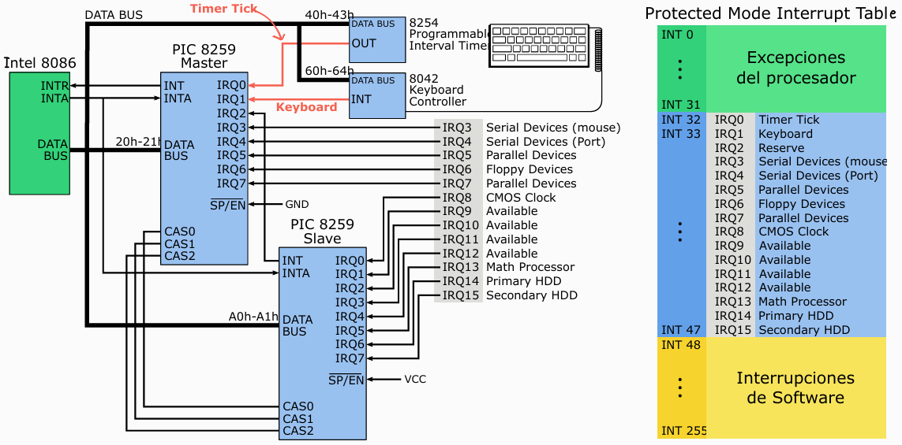

Comenzaremos por remapear el PIC, completando las funciones provistas en `pic.c`.

**¿Porque necesitamos remapear el PIC?**

El PIC viene configurado por defecto para enviar las interrupciones de hardware (IRQ0 - IRQ15) a los vectores de interrupcion 0x08 - 0x0F. Sin embargo, esto nos crea un conflicto critico. 

| Vector | Uso del Procesador (Excepciones) | Uso del PIC (por defecto) |
|--------|----------------------------------|---------------------------|
| 0x08   | Double Fault                     | IRQ0 (Timer) ❌           |
| 0x09   | Coprocessor Segment Overrun      | IRQ1 (Teclado) ❌         |
| 0x0A   | Invalid TSS                      | IRQ2 (Cascade) ❌         |
| ...    | ...                              | ...                       |

<!---->

**Resultado:** El sistema operativo no puede distinguir entre una excepción del procesador (error crítico) y una interrupción de hardware (evento normal) ya que se superponen ¿porque pasa esto? sencillo, 5 palabras, ***I N T E L***.

Entonces la solucion que nos proponen los ingenieros hijos de puta de esta empresa es que movamos las interrupciones de hardware a vectores que no esten reservados: 
- Excepciones del procesador: INT 0x00 - 0x1F
- Interrupciones de hardware (Post remapeo): 
    - IRQ 0-7 (PIC Master) -> INT 0x20 - 0x27 (Interrupciones de la 32 a 39)
    - IRQ 8-15 (PIC Slave) -> INT 0x28 - 0x2F (Interrupciones de la 40 a 47) 

**Puertos del PIC**

Cada PIC tiene dos puertos uno de comandos y uno de datos. 
El de comandos para el PIC Master en este caso esta en 0x20 y en el Slave esta en 0xA0. 
Mientras que los de datos estan en 0x21 para el Master y 0xA1 para el Slave. 

**Proceso de Remapeo:**
- En `pic1_remap()`:
    - Por el puerto de Comandos (0x20) le enviamos la **Initialization Command Word 1 (ICW1, 0x11)**, esta la informa al PIC que eventualmente recibirá la **ICW4** y además que está en **Modo Cascada** (Esta conectado a otro PIC).
    - Por el puerto de Datos (0x21) le enviamos la **ICW2_TYPE_20 (0x20)**, que le setea el *vector base de interrupciones* del PIC a 32. Esto le indica al PIC que se encargará de las interupcionnes 32 -> 39.
    - Por el puerto de Datos (0x21) le enviamos la **ICW3_SLAVE_CONNECTED (0x4)**, que le indica al PIC que es el *Master* y que el *Slave* esta conectado a su puerto **IRQ2**.
    - Por el puerto de Datos (0x21) le enviamos la **ICW4_NOT_BUFFERED (0x1)**, que setea al PIC en modo 8086.
    - Por el puerto de Datos (0x21) le enviamos la **OCW1 (0xFF)**, que deshabilita todas las lineas de interrupciones del PIC.

<!---->

```c
void pic1_remap(){
    outb(PIC1_PORT, ICW1_CASCADE_ICW4);
    outb(PIC1_PORT + 1, ICW2_TYPE_20);
    outb(PIC1_PORT + 1, ICW3_SLAVE_CONNECTED);
    outb(PIC1_PORT + 1, ICW4_NOT_BUFFERED);
    outb(PIC1_PORT + 1, OCW1);
}
```

- Ahora bien en `pic2_remap()`: 
    - Por el puerto de comandos (0xA0), igualmente que en `pic1_remap()` le enviamos la **(ICW1 0x11)**, para informarle que recibira la **ICW4** y que ademas se estara conectado a otro PIC. 
    - Por el puerto de datos (0xA1) le enviamos la **ICW2_TYPE_28 (0x28)**, que le setea el *vector base de interrupciones* en la interrupcion 40. Asi le indicamos al PIC que se encargara de las interrupciones 40 -> 47. 
    - Por el puerto de datos (0xA1) **ICW3_CONNECT_MASTER (0X2)** para indicarle al PIC que es el *Slave* y que se va a conectar por el puerto **IRQ2** al PIC *Master*
    - Por el puerto de Datos (0xA1) le enviamos la **ICW4_NOT_BUFFERED  (0x1)**, que setea al PIC en modo 8086.
    - Por el puerto de Datos (0xA1) le enviamos la **OCW1 (0xFF)**, que deshabilita todas las lineas de interrupciones del PIC.

<!---->

```c
void pic2_remap(){
    outb(PIC2_PORT, ICW1_CASCADE_ICW4);
    outb(PIC2_PORT + 1, ICW2_TYPE_28);
    outb(PIC2_PORT + 1, ICW3_CONNECT_MASTER);
    outb(PIC2_PORT + 1, ICW4_NOT_BUFFERED);
    outb(PIC2_PORT + 1, OCW1);
}
```


Ambas funciones seran llamadas por `pic_reset()`:

<!---->
```c
void pic_reset(){
    pic1_remap();
    pic2_remap();
}
```

**Proceso de inicializacion:**
Para inicializar los PICs es tan simple como primero llamar a `pic_reset()` para habilitar y configurar a los PICs. Luego llamamos a `pic_enable()` para habilitar todas las lineas de interrupciones de ambos PICs (Negando el efecto de **OCW1**). Por último habilitamos las interrupciones utilizando `sti`.

Codigo `pic_enable()`:

<!---->
```c
void pic_enable(){
    outb(PIC1_PORT + 1, 0x00);
    outb(PIC2_PORT + 1, 0x00);
}
```


Codigo de inicializacion en `kernel.asm`:

<!--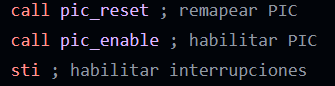-->
```x86asm
call pic_reset ;remapear PIC
call pic_enable ;habilitar PIC
sti ;habilitar interrupciones
```


<!-- El tema de la inicializacion de los PICs es un quilombo, no entiendo nada ayuda jaja (T-T) -->


# Parte 3: Paginación.

## Organización de la memoria 

Primero vamos a explicar cómo se encuentra el mapa de memoria física
para comprender de qué modo inicializar las tablas de memoria. El primer
MB de memoria física será organizado según indica la figura
[1].
En la misma se observa que a partir de la dirección `0x1200` se
encuentra ubicado el *kernel*; inmediatamente después se ubica el código
de las tareas A y B. A continuación se encuentra el código de la tarea
Idle. El resto del mapa muestra el rango para la pila del kernel, desde
`0x24000` y a continuación la tabla y directorio de páginas donde
inicializar paginación para el kernel. La parte derecha de la figura
muestra la memoria a partir de la dirección `0xA0000`, donde se
encuentra mapeada la memoria de vídeo y el código del `BIOS`.


## Unidad de Manejo de Memoria

Ya viendo la memoria física en forma más general, vemos que se divide
en: *kernel*, *área libre kernel* y *área libre tareas*.

El área asociada al *kernel* corresponde al primer MB de memoria, el
*área libre kernel* a los siguientes 3 MB, y el *área libre tareas*
comienza en el cuarto MB de memoria.

La administración de las áreas libres de memoria (área libre de kernel y
área libre de tareas) se realizará a partir de una región de memoria
específica para cada una. Podemos comprenderlas como un arreglo
predefinido de páginas y dos contadores de páginas, uno para kernel y
otro para usuarix, que indican cuál será la próxima página a emplear de
cada región. Para páginas de kernel el arreglo va de `0x100000` a
`0x3FFFFF` y para páginas de usuarix de `0x400000` a `0x2FFFFFF`. Luego
de cada pedido incrementamos el contador correspondiente. Para el
contexto de la materia no implementamos un mecanismo que permita liberar
las páginas pedidas. Vamos a referirnos al módulo que implementa este
mecanismo como la **unidad de manejo de memoria**, o en inglés, *memory
management unit*, MMU.

Las páginas del *área libre kernel* serán utilizadas para datos del
kernel: directorios de páginas, tablas de páginas y pilas de nivel cero.
Las páginas del *área libre tareas* serán utilizadas para datos de las
tareas, stack de las mismas y memoria compartida bajo demanda.


La memoria virtual de cada una de las tareas tiene mapeado inicialmente
el *kernel* y el *área libre kernel* con *identity mapping* en nivel 0.
Además se mapearán las páginas de código correspondientes, la página de
memoria compartida y una página para la pila obtenida desde el *área
libre de tareas*.

A partir de la dirección virtual *0x07000000* se encontrará una página
de memoria compartida de lectura y escritura nivel 3. Esta página será
mappeada on-demand cuando se intente hacer una lectura o escritura en
este espacio. La página física debe encontrarse en la dirección
*0x03000000*.

El código de las tareas se encontrará a partir de la dirección virtual
*0x08000000* y será mapeado como sólo lectura de nivel 3 a la dirección
física del código correspondiente. Cada tarea puede utilizar hasta 8Kb
de código. El stack será mapeado en la página siguiente, con permisos de
lectura y escritura. La página física debe obtenerse del *área libre de
tareas*. Finalmente, luego de la pila se mapeará la página de memoria
compartida como sólo lectura de nivel 3. Esta página la usaremos más
adelante para que las tareas puedan acceder fácilmente a información
relevante del contexto de ejecución (teclas apretadas, tiempo desde el
arranque del sistema, etc).

## Esquema de Paginación y atributos de sus estructuras

### Esquema de Paginación:
El esquema de paginacion de intel es el mecanismo que usan los procesadores para traducir direcciones virtuales (las que usan los programas) a direcciones fisicas (ubicaciones reales en la memoria RAM). Este esquema lo implementa la MMU explicada arriba. 

#### Traduccion de Mem. Virtual a Mem. Fisica 
Primero que nada tenemos que aclarar como se divide la *Direccion Virtual* que queremos traducir
- `Los 10 bits mas altos (22-31)`: Pertenecen al offset que le tenemos que sumar a la direccion del directorio de paginas para conseguir la entry que necesitamos. 
- `Los 10 bits intermedios (12-21)`: Pertenecen al offset que le tenemos que sumar a la direccion de la tabla de paginas para conseguir la entry que necesitamos. 
- `Los 12 bits mas bajos (0 - 11)`: Pertenecen al offset que nos indica donde esta la direccion fisica de la pagina en la que nos encontramos. 


Comenzamos por el registro de control CR3 que contiene en sus 20 bits mas altos la direccion del directorio de paginas a utilizar para la traduccion.
Esto lo calculamos de la siguiente manera en nuestro **defines.h**: 
- `#define CR3_TO_PAGE_DIR(X)  (X & 0xFFFFF000)`
    - Le pasamos a este offset el contenido del CR3 y filtramos sus 20 bits mas altos con la mascara. 

Entonces obtenemos la page directory entry con el offset correspondiente de la direccion virtual. 

Con este offset y la direccion del page directory actual, podemos conseguir la *page directory entry* que queremos.

*Ejemplo de codigo en C*: 
```C
uint32_t traductor_phy_to_virt(cr3, virt){
    page_dir = cr3 & 0xFFFFF000; //La dirección lineal está en los 20 bits mas altos asi que aplicamos una máscara
    index_page_dir = (virt >> 22) & 0x3FF; //Conseguimos los 10 bits mas altos de virt

    page_table = page_dir[index_page_dir] & 0xFFFFF000; //Aplicamos una máscara con AND para limpiar los atributos
    index_page_table = (virt >> 12) & 0x3FF; //Conseguimos los bits del medio de virt

    page = page_table[index_page_table] & 0xFFFFF000;
    offset_page = virt & 0xFFF;

    fisica = page + offset_page;

    return fisica;
}
```

```c
  uint32_t directory_offset = VIRT_PAGE_DIR(virt); //Definimos el offset para traer la pde
  pd_entry_t* cr3_page_directory = (pd_entry_t*)CR3_TO_PAGE_DIR(cr3); // Definimos la direccion de memoria para traer la pde 
  pd_entry_t pde = cr3_page_directory[directory_offset]; // definimos la pde con los datos anteriores
``` 
Una vez identificado el *Page Directory* y la *Page Directory Entry* que vamos a usar
debemos buscar su *Page Table* correspondiente, para asi poder acceder a la *Page Table Entry* que queremos. 

Justamente los 20 bits mas altos de la **PDE** corresponden a la direccion de la de la Page Table que queremos. Luego para obtener la **PTE** correspondiente necesitamos los 10 bits del medio de la direccion linear antes mencionados.
Entonces el codigo en C de la traduccion nos quedaria algo asi: 

```c
uint32_t page_table_offset = VIRT_PAGE_TABLE(virt); //Obtengo los 10 bits intermedios de la direccion virtual 
pt_entry_t* ptr_to_pt = (pt_entry_t*)(MMU_ENTRY_PADDR(pde.pt));//Obtengo la direccion a la Page Table (Arreglo de Page Table Entrys)
```

Una vez tenemos la *Page Table Entry*, en sus 20 bits mas altos, tenemos la direccion de la pagina fisica que contiene a la direccion fisica que buscamos traducir. Y en sus 12 bits mas bajos tenemos sus atributos. 
Para acceder a esta direccion fisica, tenemos que utilizar el offset que se encuentra en los 12 bits mas bajos de la direccion virtual.

El codigo en C nos quedaria de la siguiente manera: 
```c
uint32_t phy_addr_offset = VIRT_PAGE_OFFSET(virt); //Obtengo el offset de la direccion fisica guardado en la direccion virtual
paddt_t* page = ptr_to_pt[page_table_offset].page; //Obtengo mi pagina de direcciones fisicas 
paddr_t physical_dir = page[phy_addr_offset]; //Obtengo la direccion fisica

//Esto funciona suponiendo que la pagina esta mapeada en la memoria fisica. 
```

Asi se veria el mecanismo de traduccion si lo queremos representar en un grafico: 

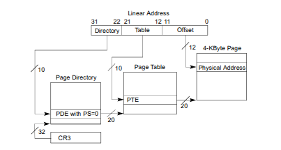

### Atributos de sus estructuras:

**Atributos del CR3**
- `20 bits mas altos del CR3`: Indica la direccion del page directory actual 
- `PCD (Page Cache Disable)`: Deshabilita cachear entradas del page directory
- `PWT (Page Write-Through)`: Deshabilita hacer write-back cuando el procesador modifica el page directory. 

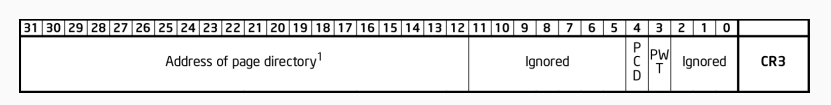

**Atributos de las Page Directory Entrys**
- `20 bits mas altos del PDE`: Indica la direccion de la pagina fisica donde esta la tabla de paginas asociada.
- `A (Accesed)`: Indica si se accedio a memoria controlada por esta PDE. Lo escribe el procesador al traducir. 
- `PCD (Page Cache Disable)`: Deshabilita cachear entradas de la page table asociada.
- `PWT (Page Write-Through)`: Deshabilita hacer write-back cuando el procesador modifica la page table asociada. 
- `U/S (User / Supervisor)`: Determina si un proceso en modo usuario puede acceder a la memoria controlada por esta PDE.
- `R/W (Read / Write)`:  Determina si un proceso puede escribir a la memoria controlada por esta PDE. 
- `P (Present)`: Es el bit 0 (Siempre en 1), indica que esta traduccion es valida. 


**Atributos de las Page Table Entrys**
- `20 bits mas altos del PDE`: Indica la direccion de la pagina fisica a la que corresponde la traduccion. 
- `G (Global)`: Marca la traduccion como global. Las traducciones globales no se invalidan al cambiar el CR3.
- `PAT (Page Attribute Table)`:  Un feature del procesador que no vamos a usar. Permite un control mas granular del mecanismo de cache. 
- `D (Dirty)`: Indica si se escribio a memoria controlada por esta PTE. Lo escribe el procesador al traducir.
- `A (Accesed)`: Indica si se accedio a memoria controlada por esta PDE. Lo escribe el procesador al traducir. 
- `PCD (Page Cache Disable)`: Deshabilita cachear entradas de la page table asociada.
- `PWT (Page Write-Through)`: Deshabilita hacer write-back cuando el procesador modifica la page table asociada. 
- `U/S (User / Supervisor)`: Determina si un proceso en modo usuario puede acceder a la memoria controlada por esta PDE.
- `R/W (Read / Write)`:  Determina si un proceso puede escribir a la memoria controlada por esta PDE. 
- `P (Present)`: Es el bit 0 (Siempre en 1), indica que esta traduccion es valida.


### Funciones de la MMU 
Definamos las funciones que se encuentran en ```mmu.c```, estas son:

- ```mmu_next_free_kernel_page```: Devuelve la dirección física de la próxima página de kernel disponible. Las páginas se obtienen en forma incremental, siendo la primera: next_free_kernel_page (0x10000).
La función retorna la dirección de memoria donde comienza la siguiente página libre de kernel.

```c
paddr_t mmu_next_free_kernel_page(void) {
    //Chequeamos si no supearamos la ultima dirección disponible de kernel. 
    if (next_free_kernel_page < 0x3FF000) { 
        //Guardamos la direccion a retornar en una variable local y actualizamos next_free_kernel_page a la siguiente dirección libre de kernel
        paddr_t actual_free_kernel_page = next_free_kernel_page; 
        next_free_kernel_page += PAGE_SIZE;
        return actual_free_kernel_page; // <= Devolvemos la dirección de la pagina libre de kernel
    } else {
        return next_free_kernel_page; // <= Devolvemos la última dirección de pagina libre de kernel
    }
}
```

- ```mmu_next_free_user_page```: Devuelve la dirección de la próxima página de usuario disponible.
 La funcion devuelve la dirección de memoria de comienzo de la próxima página libre de usuario.

```c
paddr_t mmu_next_free_user_page(void) {
    //Chequeamos si no supearamos la ultima dirección disponible de usuario.
    if (next_free_user_page < 0x2FFF000) { 
        //Guardamos la direccion a retornar en una variable local y actualizamos next_free_user_page a la siguiente dirección libre de usuario
        paddr_t actual_free_user_page = next_free_user_page; 
        next_free_user_page += PAGE_SIZE;
        return actual_free_user_page; // <= Devolvemos la dirección de la pagina libre de usuario
      } else {
        return next_free_user_page; // <= Devolvemos la última dirección de la pagina libre de usuario 
      }
}
```

- ```mmu_init_kernel_dir```: Inicializa las estructuras de paginación vinculadas al kernel y realiza el identity mapping. La función devuelve la dirección de memoria de la página donde se encuentra el directorio de páginas usado por el kernel.

```c
paddr_t mmu_init_kernel_dir(void) {
  
    zero_page((paddr_t)kpd); // Casteamos la kpd y kpt como dirreciones fisicas para limpiarlas con zero_page, de esta forma seteamos todas las entradas como "NO PRESENTES"
    zero_page((paddr_t)kpt); 
    
    kpd[0] = (pd_entry_t){ //Cargamos la primer entrada de la PAGE DIRECTORY de Kernel
      .attrs = MMU_P | MMU_W, //La seteamos como Presente y Escribible
      .pt = (KERNEL_PAGE_TABLE_0 >> 12), //Shifteamos 12 a derecha, porque solo usamos los 20 bits mas altos de los 32 totales.
    };

    // Recorremos todas las entradas de la PAGE TABLE que ubicamos anteriormente, asignandoles direcciones fisicas con identity mapping
    for (size_t i = 0; i < PAGE_SIZE / 4; i++) //PageSize = 4096 -> /4 = 1024 -> las 1024 entradas de la PT
    {
      paddr_t physical_address = i * PAGE_SIZE;

      kpt[i] = (pt_entry_t) { 
        .attrs = MMU_P | MMU_W, //La seteamos como Presente y Escribible
        .page = (physical_address >> 12), //Shifteamos 12 a derecha, porque solo usamos los 20 bits mas altos de los 32 totales.
      };  
    }

    return (paddr_t)kpd; //Retornamos la dirección de memoria correspondiente al directorio de páginas del Kernel
}
```

Ya teniendo definidas estas funciones, podemos proceder con la activacion de la **Paginación**. Como primer paso debemos inicializar el registro **CR3**, indicandole donde se encuentra el **Page Directory** utilizado por el Kernel.

Llamamos a ```mmu_init_kernel_dir()``` para inicializar el *Page Directory* del Kernel y se lo cargamos a **CR3** para inicializar el registro:

```x86asm
call mmu_init_kernel_dir ;Cargar directorio de paginas 

mov cr3, eax ;inicializar CR3
```

Por último, tenemos que setear el *Bit 31* del registro **CR0** para asi habilitar la **Paginación**.

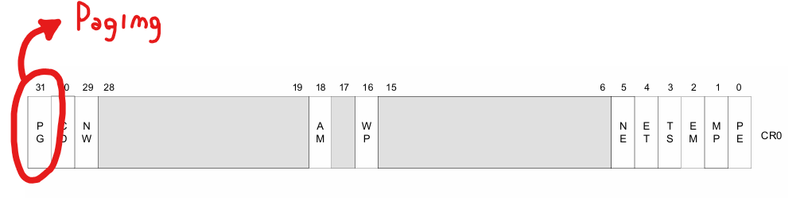

Esto lo hacemos con el siguiente codigo de ASM:

```x86asm
mov eax, cr0 ;Cargamos CR0 en eax
or eax, CR0_PG_ENABLE_MASK ;Le hacemos un OR con las mascara 0x80000000 (Equivale a un 1 en el 31 y el resto 0)
mov cr0, eax ;Actualizamos CR0 para habilitar la paginación
```

Antes de poder pasar a tareas, necesitamos definir algunas funciones más en ```mmu.c```.

- ```mmu_map_page```: Agrega las entradas necesarias a las estructuras de paginación de modo de que la dirección virtual ``virt`` se traduzca en la dirección física ``phy`` con los atributos definidos en `attrs`.
    - Parametros de entrada:
        -  ``cr3`` es el contenido que se ha de cargar en un registro CR3 al realizar la traducción.

        - ``virt`` la dirección virtual que se ha de traducir en phy

        - ``phy`` la dirección física que debe ser accedida (dirección de destino)

        - ``attrs`` los atributos a asignar en la entrada de la tabla de páginas

```c
void mmu_map_page(uint32_t cr3, vaddr_t virt, paddr_t phy, uint32_t attrs) {

  uint32_t directory_offset = VIRT_PAGE_DIR(virt); //Definimos el offset para traer la pde
  pd_entry_t* cr3_page_directory = (pd_entry_t*)CR3_TO_PAGE_DIR(cr3); // Definimos la direccion de memoria para traer la pde 

  pd_entry_t pde = cr3_page_directory[directory_offset]; // definimos la pde con los datos anteriores

  if (!(pde.attrs & MMU_P)) { 
    // Lògica no presente
    cr3_page_directory[directory_offset].attrs = attrs | MMU_P | MMU_W;

    uint32_t new_page_table = (uint32_t)mmu_next_free_kernel_page();
    zero_page(new_page_table); 

    cr3_page_directory[directory_offset].pt = HIGHEST_20_BITS(new_page_table); 
    pde = cr3_page_directory[directory_offset];
  }
  
  // Lògica para presente
  uint32_t page_table_offset = VIRT_PAGE_TABLE(virt);

  pt_entry_t* ptr_to_pt = (pt_entry_t*)(MMU_ENTRY_PADDR(pde.pt));

  ptr_to_pt[page_table_offset].page = HIGHEST_20_BITS(phy);
  ptr_to_pt[page_table_offset].attrs = attrs | MMU_P;

  //Reseteo la TLB para evitar que queden traducciones desactualizadas
  tlbflush();

  return; // dede
}
```

- ```mmu_unmap_page```: Elimina la entrada vinculada a la dirección virt en la tabla de páginas correspondiente.
    - Parametros de entrada:
        - ``cr3`` que indica donde se encuentra la **PD** en la cual queremos desmapear.

        - ``virt`` la dirección virtual que se ha de desvincular.

    - Valor de retorno:
        - La dirección física de la página desvinculada.

```c
paddr_t mmu_unmap_page(uint32_t cr3, vaddr_t virt) {
  pd_entry_t* pd = (pd_entry_t*) CR3_TO_PAGE_DIR(cr3); //Obtengo la direccion de la PD ubicada en CR3
  //uint32_t offset_dir_virt : 10; 
  uint32_t offset_dir_virt =  VIRT_PAGE_DIR(virt); //Obtengo el offset de la PD ubicado en mi virtual address
  pd_entry_t pde = pd[offset_dir_virt]; //Lo utilizo como indice para obtener la PDE

  pt_entry_t* pt = (pt_entry_t*) (pde.pt << 12); //Del struct PDE obtengo la direccion de la PT (son 20 bits, lo shifteo 12 para que sean 32)
  //uint32_t offset_table_virt : 10; 
  uint32_t offset_table_virt = VIRT_PAGE_TABLE(virt); //Obtengo el offset de la PT ubicado en mi virtual address

  paddr_t phy_return = (paddr_t) (pt[offset_table_virt].page << 12); //Yo quiero retornar esta direccion fisica
  
  //Limpio la PTE para desvincularla
  pt[offset_table_virt].page = 0;
  pt[offset_table_virt].attrs = 0;

  //Reseteo la TLB para evitar que queden traducciones desactualizadas
  tlbflush();

  return phy_return;
}
```

- ```mmu_init_task_dir```: Inicializa las estructuras de paginación vinculadas a una tarea cuyo código se encuentra en la dirección phy_start.
    - Parametros de entrada:
        - ```phy_start``` es la dirección donde comienzan las dos páginas de código de la tarea asociada a esta llamada.
    - Valor de retorno:
        - La función devolverá la dirección del *Page Directory* que se ha de cargar en un registro ***CR3*** para la tarea asociada a esta llamada.

```c
paddr_t mmu_init_task_dir(paddr_t phy_start) { 
    //Pedimos una nueva pagina de kernel para el page directory
    paddr_t pd_address_cr3 = mmu_next_free_kernel_page(); 

    pd_entry_t* task_dir = (pd_entry_t*)pd_address_cr3;
    zero_page(pd_address_cr3);

    // **Mapeo los primero 4mb**
    // 4MB = 1024 pags (cada pag son 4KB)
    // Es identity mapping, asi que las virt coinciden con las fisicas
    for (uint32_t i = 0; i < 1024; i++) {
        paddr_t addr = i * PAGE_SIZE;  // Tanto la virt como la fisica
        mmu_map_page(pd_address_cr3, addr, addr, MMU_P | MMU_W);  // Presente + R/W , Kernel lvl
    }
    
    // Mapeamos las 2 paginas de codigo...
    mmu_map_page(pd_address_cr3, TASK_CODE_VIRTUAL, phy_start, MMU_P | MMU_U);
    mmu_map_page(pd_address_cr3, TASK_CODE_VIRTUAL + PAGE_SIZE, phy_start + PAGE_SIZE, MMU_P | MMU_U);
    
    // Pedimos una pagina de usuario para la pila
    paddr_t phy_stack = mmu_next_free_user_page(); 
    // Mapeamos la pagina de pila
    mmu_map_page(pd_address_cr3, TASK_STACK_TOP, phy_stack, MMU_P | MMU_W | MMU_U);
    // Mapeamos la memoria compartida
    mmu_map_page(pd_address_cr3, TASK_SHARED_PAGE, SHARED, MMU_P | MMU_W | MMU_U);
    
    return pd_address_cr3; 
}
```

En el TP se nos pidió codear una funcion auxiliar para manejar la excepcion *Page Fault* **(Int 14)**, esta excepcion se activa cuando intentamos escribir/leer en un espacio de memoria no mapeado (No presente). 
Esta func. aux. se encarga de detectar especificamente si el *Page Fault* se dió dentro del **espacio de memoria On Demand**, y en caso de ser así, mappear dicha pagina de memoria y devolver **True**. En caso de no haberse dado en este espacio de memoria, simplemente devuelve **False**.

La función se podría extender en caso de que nos interesara manejar escrituras/lecturas en otros espacios de memoria diferente a On Demand.

```c
bool page_fault_handler(vaddr_t virt) {
  
  if (virt >= ON_DEMAND_MEM_START_VIRTUAL && virt <= ON_DEMAND_MEM_END_VIRTUAL) //Estoy en direccion de on demand (0x07000000 a 0x07000FFF)
  {
    print("Atendiendo page fault...", 0, 0, C_FG_WHITE | C_BG_BLACK);
    //Traemos cr3
    uint32_t cr3 = rcr3(); 
    //Definimos la direccion fisica de la pagina ondemand
    paddr_t on_demand_start_addr = ON_DEMAND_MEM_START_PHYSICAL; 

    // Pongo todo en 0
    //zero_page(on_demand_start_addr);

    //Llamamos a map_page para que se encargue de verificar si esta o no mapeada
    mmu_map_page(cr3, virt, on_demand_start_addr, MMU_P | MMU_U | MMU_W);
    
    return true;     
  }
  
  return false; 
}
```

# Parte 4: Tareas.

Definimos **Tarea** a una unidad de trabajo que un procesador puede despachar, ejecutar, y detener a voluntad, bajo la forma de:
- La instancia de un programa (o, expresado en términos del lenguaje de teoría de Sistemas Operativos; proceso, o thread).

- Un handler de interrupción, o excepción.

- Un servicio del S.O. (por ejemplo en Linux, cualquiera de las Syscall).

Procederemos a enunciar algunas definiciones importantes para esta sección:

#### Espacio de Ejecución:
Es el conjunto de secciones de código, datos, y pila que componen la tarea. 

#### Contexto de ejecución: 
Es el conjunto de valores de los registros internos del procesador en cada momento.

#### Espacio de Contexto de ejecución:
Se compone de un bloque de memoria en el que el Sistema Operativo almacenará el contexto completo de ejecución del procesador.

#### Context Switch:
Salvar y restaurar el contexto de dos procesos o threads cuando se suspende la ejecucion del primero (se salva su contexto) para pasar a ejecutar el segundo (se restaura su contexto).
Como las tareas en una computadora no operan simultaneamente, sino serialmente pero conmutando a entre ellas a una gran velocidad; se producen cientos o miles de **context switches** por segundo. Nuestros sentidos son incapaces de captar la ntermitencia entre tareas, creando asi la sensación de simultaneidad. El S.O. tiene un módulo de software llamado **scheduler** que se encarga de la conmutacion entre tareas.

#### Scheduler:
Encargado de conmutar las tareas. Este define un intervalo de tiempo (**Time Frame**), que a su vez con la ayuda de un temporizador, es dividido en inervalos mas pequeños que se convierten en la unidad de tiempo (Asigna a cada tarea un porcentaje de este **time frame**). Cada tarea tiene así unos milisegundos para progresar, expirados los cuales suspende una tarea y despacha para su ejeción la siguiente de la lista.

Para poder ejecutar tareas en nuestro kernel vamos a precisar:

-   Definir las estructuras de las tareas disponibles para ser
    ejecutadas

-   Tener un scheduler que determine la tarea a la que le toca
    ejecutase en un período de tiempo, y el mecanismo para el
    intercambio de tareas de la CPU

-   Iniciar el kernel con una *tarea inicial* y tener una *tarea idle*
    para cuando no haya tareas en ejecución

Y para definir nuestro sistema de tareas necesitamos explicar las siguientes estructuras: 

- El **Task Register** es un registro que almacena el selector de segmento de la tarea en ejecucion. Se utiliza para encontrar la TSS de la tarea actual. Este esta conformado por dos partes: 
  - La **parte visible** puede leerse y escribirse mediante instrucciones de software (*LTR, STR*). Contiene un selector de 16 bits que apunta a un *TSS Descriptor* almacenado en la *GDT*.
  - La **parte invisible** no es accesible al software. El procesador la mantiene internamente para optimizar el acceso a la TSS. Contiene una direccion base de 32 bits en memoria de la TSS y un limite de tamaño de segmento de 16 bits. 

Cabe recalcar que este registro es de 64 bits de tamaño. 


- La **TSS (Task State Segment)** es un segmento en memoria, que guarda el contexto de ejecucion de una tarea, es decir, que va a guardar los valores en los registros de la CPU y que usara en la ejecucion de la misma. Los campos mas relevantes de la *TSS* son:  
    - **EIP**
    - **ESP**,**EBP**,**ESP0**
    - Los selectores de segmento **CS**,**DS**,**ES**,**FS**,**GS**,**SS**,**SS0**
    - El **CR3** que va a tener la paginacion asociada a la tarea. Asi cada tarea tendra su propio Page Directory
    - **EFLAGS** en 0x00000202 para tener las interrupciones habilitadas. 


- Los **TSS Descriptors** son entradas a la GDT de tipo sistema, configuradas para apuntar a un Segmento que guarda el cotexto de una tarea **(TSS)**.

>**DISCLAIMER:**
>**EL TSS DESCRIPTOR ES EXCLUSIVO DE LA GDT,**
>**NO PUEDE SER INGRESADO EN LA LDT O IDT.**

*Sus atributos son los siguientes*: 
-  **AVL** 

-  **B** (Busy): Indica si la tarea esta "Busy", una tarea "Busy" es aquella que esta en ejecución o suspenso. Lo inicializaremos siempre en 0. El procesador utiliza la **B flag** para detector intento de llamada a una tarea cuya ejecución fue interrumpida. Para asegurarse de que solo hay una **B Flag** asociada a una tarea, cada **TSS** tendría que tener un solo **TSS Descriptor** que lo apunte.

-  **DPL** (Descriptor Privilege Level): Es el nivel de privilegio que se precisa para acceder al segmento. Usamos nivel 0 porque solo el kernel puede intercambiar tareas.
    En la mayoria de sistemas, los DPLs de TSS Descriptors se setean en valores menores a 3, para que solo software privilegiado pueda realizar cambios de tareas. Sin embargo, en aplicaciones multitarea, DPLs de algunos TSS Descriptors podrian estar seteados a 3 para permitir a el cambio de tareas a nivel de privilegio de aplicación o usuario. 

-  **LIMIT**: Es el tamaño maximo de la TSS. 67h es el minimo requerido. 

-  **BASE**: Indica la direccion base de la TSS.

-  **G** (Granularity): Cuando esta seteada en 0, el limite debe tener un valor igual o mayor a *0x67*; un byte menos que el tamaño minimo de una **TSS**. Intentar cambiar a una tarea cuyo **Descriptor TSS** tenga un limite menor a *0x67* genera una *invalid-TSS-exception* (#TS).

-  **P**: Indica que el segmento este presente en memoria y se pueda acceder a el. 

-  **TYPE**: Tipo de Segmento

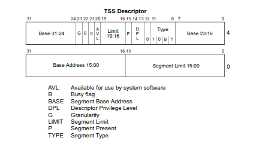
-------------------------

Veamos como se definen nuestra **Tarea Inicial** y **Tarea Idle**, comenzemos por las TSS de las mismas, disponibles en el archivo ``tss.c``:

```c
/*
 * TSS de la tarea inicial (sólo se usa para almacenar el estado del procesador
 * al hacer el salto a la tarea idle
 */
tss_t tss_initial = {0};
// TSS de la tarea idle
tss_t tss_idle = {
  .ss1 = 0,
  .cr3 = KERNEL_PAGE_DIR,
  .eip = TASK_IDLE_CODE_START,
  .eflags = EFLAGS_IF,
  .esp = KERNEL_STACK,
  .ebp = KERNEL_STACK,
  .cs = GDT_CODE_0_SEL,
  .ds = GDT_DATA_0_SEL,
  .es = GDT_DATA_0_SEL,
  .gs = GDT_DATA_0_SEL,
  .fs = GDT_DATA_0_SEL,
  .ss = GDT_DATA_0_SEL,
};
```

En este archivo tambien encontramos:

- ``tss_init()``: Inicializa las primeras entradas de TSS (Inicial y Idle)

```c
void tss_init(void) {
  tss_t* tss_idle_ptr = &tss_idle; 
  gdt[GDT_IDX_TASK_IDLE] = tss_gdt_entry_for_task(tss_idle_ptr);
  tss_t* tss_initial_ptr = &tss_initial;
  gdt[GDT_IDX_TASK_INITIAL] = tss_gdt_entry_for_task(tss_initial_ptr);
}
```

- ``tss_gdt_entry_for_task``: Genera una entrada de la **GDT** para una **TSS**.

```c
gdt_entry_t tss_gdt_entry_for_task(tss_t* tss) {
  return (gdt_entry_t) {
    .g = 0,
    .limit_15_0 = sizeof(tss_t) - 1,
    .limit_19_16 = 0x0,
    .base_15_0 = GDT_BASE_LOW(tss),
    .base_23_16 = GDT_BASE_MID(tss),
    .base_31_24 = GDT_BASE_HIGH(tss),
    .p = 1,
    .type = DESC_TYPE_32BIT_TSS,
    .s = DESC_SYSTEM,
    .dpl = 0,
  };
}
```

- ``tss_tasks``: Lista de tss donde se guardan las tss al hacer un cambio de contexto.

```c
tss_t tss_tasks[MAX_TASKS] = {0};
```

- ``tss_set``: ?

```c
/**
 * Define el valor de la tss para el indice task_id
 */
void tss_set(tss_t tss, int8_t task_id) {
  kassert(task_id >= 0 && task_id < MAX_TASKS, "Invalid task_id");

  tss_tasks[task_id] = tss;
}
```
